# 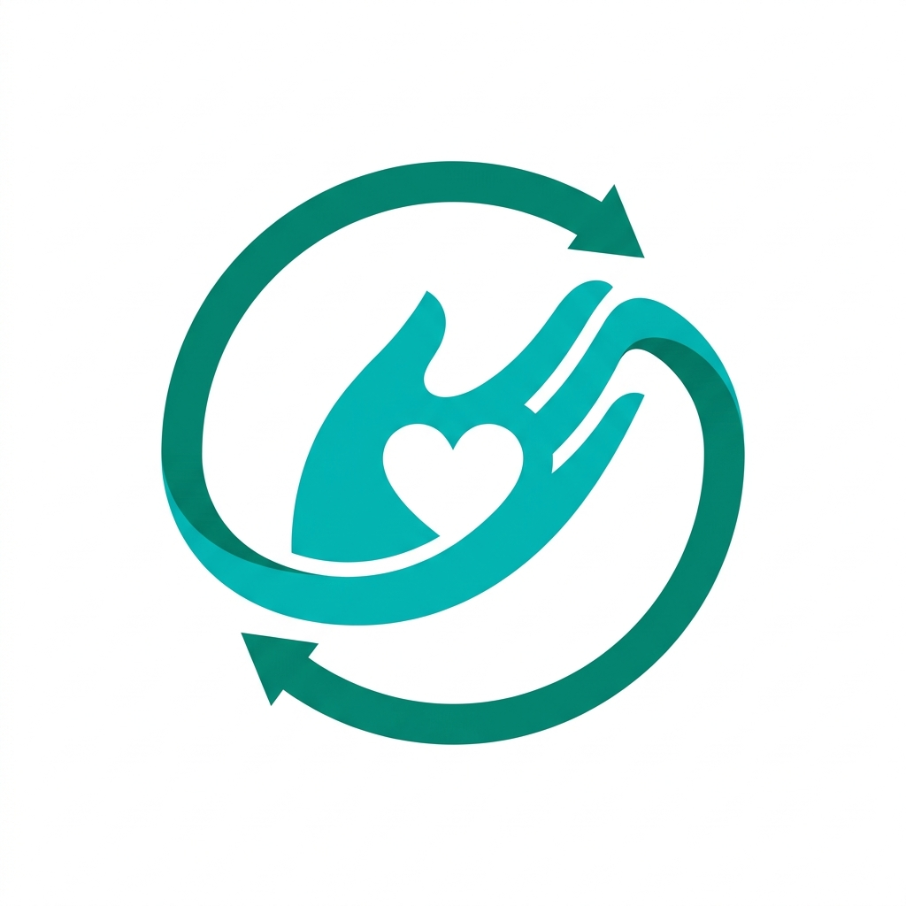 ImpactForge

A modern, scalable, and responsive **Volunteer Management & Community Engagement Platform** built with **Flutter** and **Firebase**. 

ImpactForge empowers organizations to coordinate volunteer activities in real-time, verify task submissions securely, and gamify community contributions through progress dashboards and leaderboards. Designed with a clean, responsive layout suited for both web and mobile clients.

---

## 🚀 Key Features

*   **Secure Authentication**: Dual-mode login supporting Email/Password and Google OAuth.
*   **Real-time Task Allocation**: Interactive task boards for volunteers to discover and join local community drives.
*   **Multimedia Evidence Verification**: Secure report submission with image uploading for task completion verification.
*   **Impact Analytics Dashboard**: Real-time charts demonstrating volunteer metrics, hours spent, and overall community impact.
*   **Gamification & Leaderboard**: Global ranking system based on active points, milestones, and reward badges.
*   **Administrative Suite**: Dedicated admin dashboard for creating tasks, reviewing submissions, elevating volunteer roles, and monitoring operations.

---

## 🛠️ Technology Stack

*   **Frontend**: Flutter (Dart)
*   **State Management & Routing**: GetX (reactive state, dependency injection, and clean hash-based web routing)
*   **Styling & UI**: Material 3 UI design, custom glassmorphic cards, responsive overlays, and custom Google Fonts typography
*   **Database**: Cloud Firestore (Real-time NoSQL database)
*   **Backend Storage**: Firebase Storage (Secure hosting for submitted completion images)
*   **Security**: Attribute-Based Access Control (ABAC) enforced via granular Cloud Firestore Security Rules

---

## 🏗️ System Architecture

The project follows a clean architecture separating the presentation layer, reactive state controllers, and the cloud data source layer.

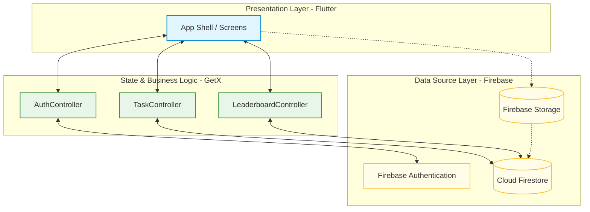

---

## 📊 Database Schema (Firestore Collections)

```
├── users (Key: email)
│   ├── name (String)
│   ├── role (String: 'volunteer' | 'admin')
│   ├── points (Number)
│   └── joinDate (Timestamp)
│
├── tasks (Key: auto-generated ID)
│   ├── title (String)
│   ├── description (String)
│   ├── pointsAwarded (Number)
│   └── deadline (Timestamp)
│
├── active_tasks (Key: auto-generated ID)
│   ├── taskId (String)
│   ├── userEmail (String)
│   ├── status (String: 'ongoing' | 'submitted' | 'verified')
│   └── assignedAt (Timestamp)
│
└── submissions (Key: auto-generated ID)
    ├── taskId (String)
    ├── userEmail (String)
    ├── description (String)
    ├── imageUrl (String)
    └── submittedAt (Timestamp)
```

---

## 📥 Getting Started

### Prerequisites
*   [Flutter SDK](https://docs.flutter.dev/get-started/install) (v3.0.0 or higher)
*   Dart SDK (v3.0.0 to v4.0.0)

### Installation & Run

1. Clone the repository:
   ```bash
   git clone https://github.com/yourusername/impactforge.git
   cd impactforge
   ```

2. Retrieve package dependencies:
   ```bash
   flutter pub get
   ```

3. Configure Firebase:
   *   Place your `google-services.json` inside `android/app/` for Android.
   *   Web parameters are preconfigured inside `lib/constants/app_config.dart`.

4. Build and run locally:
   ```bash
   # Run app in default browser
   flutter run -d chrome
   ```

---

## 📱 Application Preview

Once you place your captured screenshots in the `screenshots/` directory, they will be displayed here in high resolution:

### Onboarding & Security

| Splash Screen | Login Screen | Signup Screen |
| :---: | :---: | :---: |
| 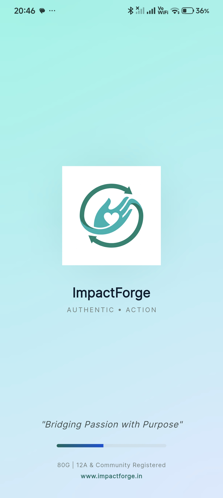 | 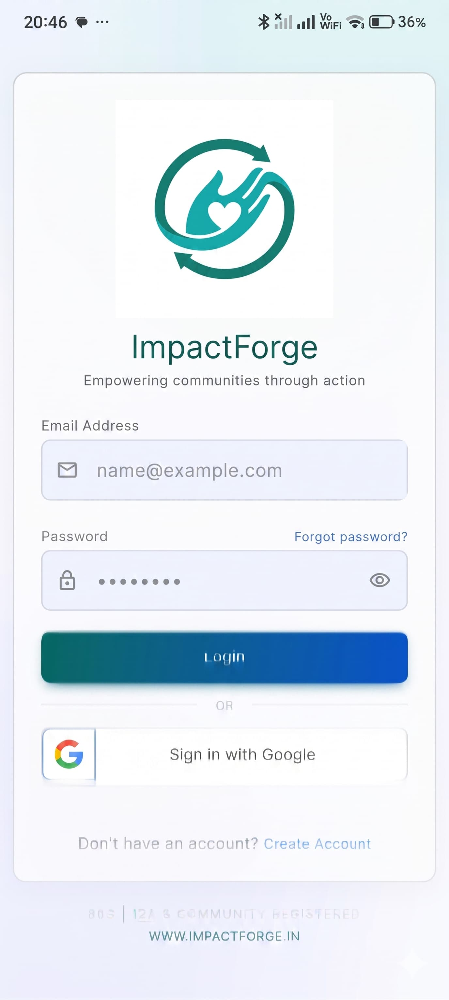 | 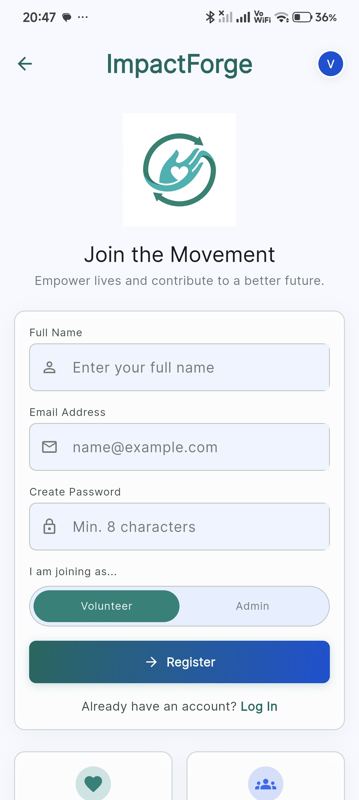 |

### Volunteer Lifecycle

| Home Dashboard | Tasks List | Task Details |
| :---: | :---: | :---: |
| 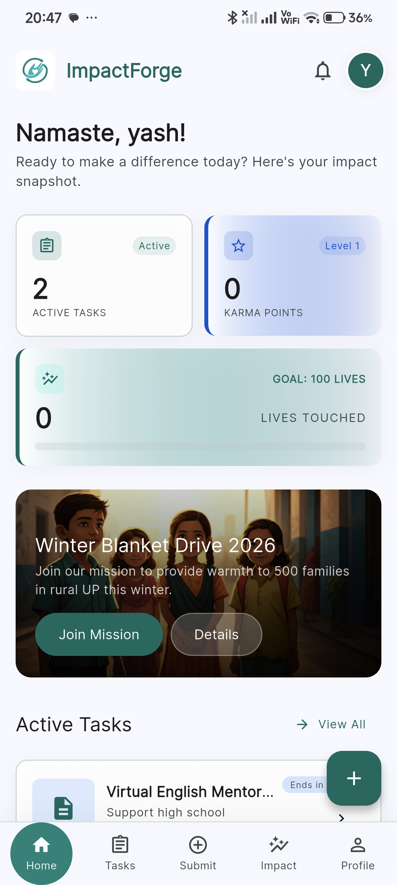 | 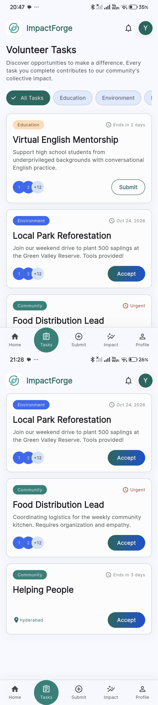 | 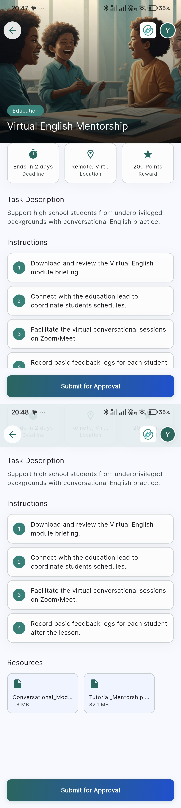 |

### Submissions & Leaderboard

| Task Submission | Impact Analytics | Leaderboard |
| :---: | :---: | :---: |
| 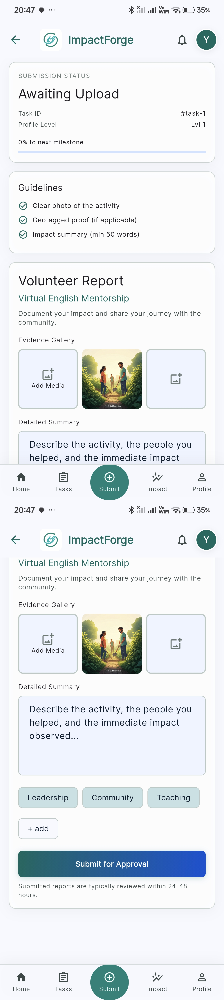 | 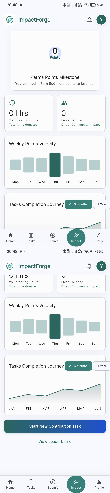 |  |

### User Settings & Admin Dashboard

| Profile Screen | Edit Profile | Account Settings | Admin Dashboard |
| :---: | :---: | :---: | :---: |
| 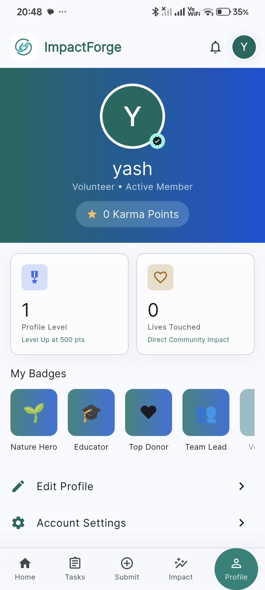 | 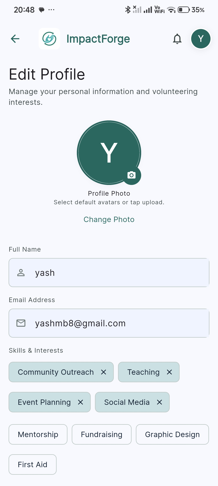 | 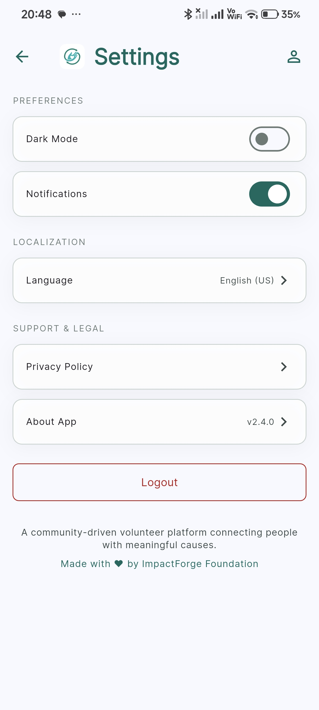 |  |

---

## 🛡️ License
Distributed under the MIT License. See `LICENSE` for more information.
